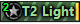
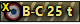
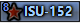
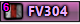

Qualan's Contours
================

This is a set of contour icons for [World of Tanks](http://www.worldoftanks.com).

They were designed primarily to be used in over target markers.

Examples:

Features:
* Class identification by color.
  * Green Lights
  * Brown Mediums
  * Red Heavies
  * Blue Tank Destroyers
  * Purple Artillery
* Compact tier numbers (with X for tier 10)
* National flags
* Large and easy to read names
* Unobtrusive Premium (gold) and Special (green) availability stripes
* Dark warning stripes if any autoloading gun is possible
